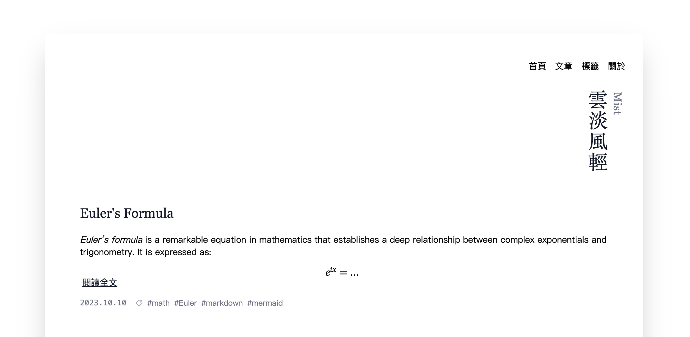

# Mist Theme for Hugo


<a href="https://www.buymeacoffee.com/kurokuma" target="_blank"></a>


## Overview

*Mist* is a Hugo theme that I built while planning to create my personal blog. I have always been a fan of minimalist theme ``astro-theme-typography``, and I wanted to customize some existing Hugo themes to fit my taste. As I made more and more changes, the theme evolved significantly and became quite different from the original themes I started with. This journey led to the creation of *Mist*, a simple and elegant theme designed to provide a clean and modern blogging experience.



<div align="center"><a href="https://kurokuma-lab.github.io/hugo-theme-mist/" target="_blank"><strong>View Demo Site</strong></a></div>


## Features

- Responsive design
- Syntax highlighting
- Mermaid diagrams support
- LaTeX math support
- Multi-language support (via i18n files)

## Installation

### Step 1: Install Hugo

Make sure you have Hugo installed. If not, you can download it from [Hugo's official website](https://gohugo.io/getting-started/installing/).

### Step 2: Install the Theme

Clone the theme into your Hugo site's `themes` directory:

```bash
git submodule add https://github.com/kurokuma-lab/hugo-theme-mist.git themes/mist
```

### Step 3: Configure the Theme
Copy the example configuration file and default archetype template file to your site's root directory:

```bash
cp themes/mist/exampleSite/hugo.toml .
cp themes/mist/archetypes/default.md archetypes/
```

Adjust the configuration in hugo.toml to fit your needs.

### Step 4: Add i18n Translation File
Currently, ``Mist`` supports ``en``, ``zh-cn``, ``zh-tw`` and ``ja``. To add a new language, you need to add a new language file in the ``i18n`` folder and then change the ``defaultContentLanguage`` in the ``hugo.toml`` file. For example, to add *Korean* support, create a new file named ``ko.toml`` in the ``i18n`` folder and change the ``defaultContentLanguage`` to ``ko``.

### Step 5: Create the About Page
Create an about.md file in the content directory:

```md
+++
date = '2024-12-25T00:00:00+00:00'
draft = false
title = 'About'
+++

This is the about page.
```

if you don't want to have a about page, you can remove the about page from the ``menu`` in the ``hugo.toml`` file. Furthemore, you can also change the ``menu`` in the ``hugo.toml`` file to add a new page to the menu.


## Further Customization
To customize the theme and layout further, you can modify the HTML templates in the layouts directory. The theme uses ``UnoCSS`` as the CSS framework. To modify the CSS, follow these steps:

1. Install ``Node.js`` and ``npm``

2. Install dependencies: Navigate to the theme directory and run the following command to install the necessary dependencies:
   ```bash
   npm install
   ```

3. Start the development environment: Run the following command to start the development environment. This would start ``unocss`` and ``hugo`` in ``watch`` mode.

   ```bash
   npm run dev
   ```

4. Run the following command for building the theme:
   ```bash
   npm run build
   ```