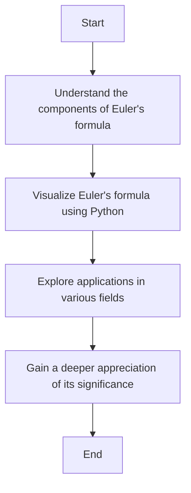

+++
title = "Euler's Formula"
date = 2023-10-10T10:00:00-07:00
draft = false
tags = ['math', 'Euler', 'mermaid', 'code']
+++

Euler's formula is a fundamental equation in complex analysis that establishes a deep relationship between trigonometric functions and the complex exponential function. It is given by:

$$
e^{ix} = \cos(x) + i\sin(x)
$$

where:
- \( e \) is the base of the natural logarithm,
- \( i \) is the imaginary unit, and
- \( x \) is a real number.

This formula is remarkable because it connects the exponential function with the trigonometric functions cosine and sine.

| \( x \) | \( e^{ix} \) |
|------|--------|
| \( 0 \)   | \( 1 \) |
| \( \frac{\pi}{2} \) | \( i\) |
| \( \pi \) | \( -1 \) |
| \( \frac{3\pi}{2} \) | \( -i \) |
| \( 2\pi \) | \( 1 \) |


## Visualizing Euler's Formula

To better understand Euler's formula, we can visualize it using Python. Below is a Python code snippet that plots Euler's formula on the complex plane.

```python
import numpy as np
import matplotlib.pyplot as plt

# Values of x from 0 to 2*pi
x = np.linspace(0, 2 * np.pi, 1000)

# Euler's formula
y = np.exp(1j * x)

# Plotting
plt.figure(figsize=(8, 8))
plt.plot(np.real(y), np.imag(y), label=r'$e^{ix} = \cos(x) + i\sin(x)$')
plt.xlabel('Real Part')
plt.ylabel('Imaginary Part')
plt.title('Visualization of Euler\'s Formula')
plt.legend()
plt.grid(True)
plt.axhline(0, color='black',linewidth=0.5)
plt.axvline(0, color='black',linewidth=0.5)
plt.show()
```

This code generates a plot of Euler's formula on the complex plane, showing how the exponential function traces out a circle.

## Applications of Euler's Formula

Euler's formula has numerous applications in mathematics and engineering, including:
- **Signal processing**: Representing sinusoidal signals as complex exponentials.
- **Quantum mechanics**: Describing wave functions.
- **Electrical engineering**: Analyzing AC circuits.

Understanding Euler's formula provides a powerful tool for working with complex numbers and their applications in various fields.

## Conclusion

Euler's formula is a beautiful and profound equation that reveals the deep connections between exponential and trigonometric functions. By visualizing it, we can gain a better appreciation of its significance and applications.

## Euler's Formula Flowchart

Here is a flowchart to illustrate the steps involved in understanding and applying Euler's formula:




## Text Formatting Examples

Regular text can be formatted as **bold**, *italic*, or ***bold italic***. You can also use ~~strikethrough~~ for deleted text.

> "Euler's formula is arguably the most beautiful theorem in mathematics."
> — Richard Feynman

---

## List Examples

Here are some key mathematical constants:
* π (pi): approximately 3.14159
  * Used in geometry and trigonometry
  * Appears in Euler's formula
* e (Euler's number): approximately 2.71828
  * Base of natural logarithms
  * Also appears in Euler's formula

1. First discovered by Euler in 1748
2. Published in his work *Introductio in analysin infinitorum*
3. Extended by many mathematicians since then

## References

For more information, check out the [Wikipedia article on Euler's formula](https://en.wikipedia.org/wiki/Euler%27s_formula).