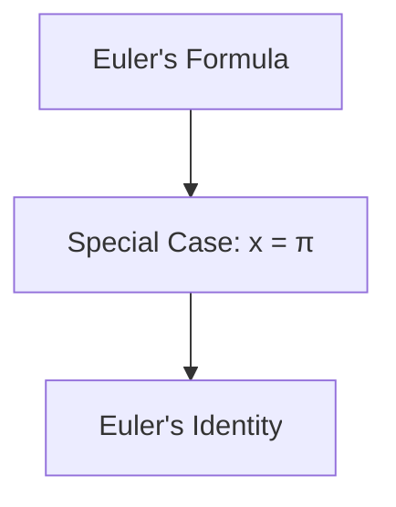

+++
title = "Euler's Formula"
date = 2023-10-10T10:00:00-07:00
draft = false
tags = ['math', 'Euler', 'markdown', 'mermaid']
+++

*Euler's formula* is a remarkable equation in mathematics that establishes a deep relationship between complex exponentials and trigonometry. It is expressed as:  

$$ e^{ix} = \cos(x) + i \sin(x) $$

Where:  
- \( e \) is the base of the natural logarithm  
- \( i \) is the imaginary unit \( (i^2 = -1) \)  
- \( x \) is a real number  

> "Euler's formula is arguably the most beautiful theorem in mathematics."
> — Richard Feynman

Euler's formula is often considered the most elegant equation because it relates five fundamental constants:  
- **\( e \)** – Euler's number  
- **\( i \)** – Imaginary unit  
- **\( \pi \)** – Pi (3.14159...)  
- **1** – Unity  
- **0** – Zero  

## The Magic of \( e^{i\pi} + 1 = 0 \)  
This special case is known as **Euler's Identity**:  

$$ e^{i\pi} + 1 = 0 $$

### Values of \( e^{ix} \) for Different \( x \)

|\( x \) |	\( e^{ix} \) | \( \cos(x) \) |	\( \sin(x) \) |
| --- | --- | --- | --- |
|\( 0 \) |	\( 1 + 0i \)	| 1	 | 0 |
|\( \pi/2 \) |	\( 0 + i \) |	0	| 1 |
|\( \pi \) |	\( -1 + 0i \) |	-1	| 0 |
|\( 3\pi/2 \) |	\( 0 - i \)	| 0 | -1 |
|\( 2\pi \) |	\( 1 + 0i \) |	1 |	0 |

Euler’s formula can be derived by expanding \( e^{ix} \) as a Taylor series:

$$ e^{ix} = 1 + ix + \frac{(ix)^2}{2!} + \frac{(ix)^3}{3!} + \dots $$

Expanding:

$$ e^{ix} = 1 + ix - \frac{x^2}{2!} - i\frac{x^3}{3!} + \dots $$

Grouping real and imaginary parts:

$$ e^{ix} = \left( 1 - \frac{x^2}{2!} + \dots \right) + i \left( x - \frac{x^3}{3!} + \dots \right) $$

Which simplifies to:
$$ e^{ix} = \cos(x) + i \sin(x) $$

## Visualizing Euler's Formula

To better understand Euler's formula, we can visualize it using ``Python``. Below is a ``Python`` code snippet that plots Euler's formula on the complex plane.

```python
import numpy as np
import matplotlib.pyplot as plt

# Values of x from 0 to 2*pi
x = np.linspace(0, 2 * np.pi, 1000)

# Euler's formula
y = np.exp(1j * x)

# Plotting
plt.figure(figsize=(8, 8))
plt.plot(np.real(y), np.imag(y), label=r'$e^{ix} = \cos(x) + i\sin(x)$')
plt.xlabel('Real Part')
plt.ylabel('Imaginary Part')
plt.title('Visualization of Euler\'s Formula')
plt.legend()
plt.grid(True)
plt.axhline(0, color='black',linewidth=0.5)
plt.axvline(0, color='black',linewidth=0.5)
plt.show()
```

This code generates a plot of Euler's formula on the complex plane, showing how the exponential function traces out a circle.

## Applications of Euler's Formula

Euler's formula has numerous applications in mathematics and engineering, including:
- **Signal processing**: Representing sinusoidal signals as complex exponentials.
- **Electrical engineering**: Analyzing AC circuits.

Understanding Euler's formula provides a powerful tool for working with complex numbers and their applications in various fields.

## Historical Context


## Euler's Formula Flowchart

Here is a flowchart to illustrate the steps involved in understanding ***Euler's Identity***:



## Conclusion

Euler's formula is a beautiful and profound equation that reveals the deep connections between exponential and trigonometric functions. By visualizing it, we can gain a better appreciation of its significance and applications.

--- 

### Here are some key mathematical constants:
* \(\pi\): approximately 3.14159
  * Used in geometry and trigonometry
  * Appears in Euler's formula
* \(e\) (Euler's number): approximately 2.71828
  * Base of natural logarithms
  * Also appears in Euler's formula

1. First discovered by Euler in 1748
2. Published in his work *Introductio in analysin infinitorum*
3. Extended by many mathematicians since then

## References

For more information, check out the [Wikipedia article on Euler's formula](https://en.wikipedia.org/wiki/Euler%27s_formula).